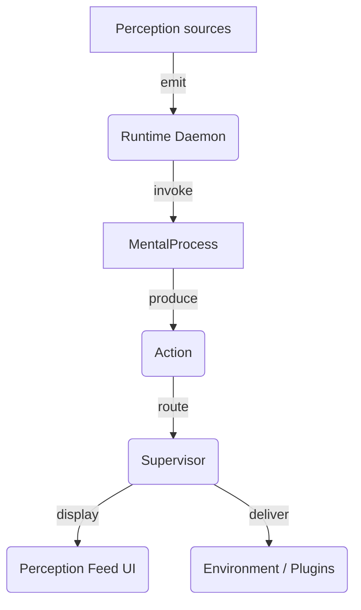

## Big-picture

* **Runtime Daemon** – single-agent event loop (one OS process per soul).
* **Supervisor** – spawns daemons, routes events, restarts on crash.
* **UI** – simple timeline; input box just emits `Perception{type:"utterance"}`.
* **Plugins** – bidirectional adapters (clock, game engine, etc.).

---
